<div align="center">

<!-- Animated Header -->


<br/>

<!-- Badges -->
<p>
  
  
  
  
  
  
</p>

<p>
  
  
  
  
</p>

<br/>

<p><em>A production-ready ML project predicting residential house prices using the Ames, Iowa housing dataset.<br/>Built with professional engineering practices -- modular code, reproducible pipelines, SHAP explainability, and a REST API.</em></p>

</div>

<br/>

---

<!-- Animated Divider -->


## Table of Contents

<details>
<summary><b>Click to expand</b></summary>

- [Project Overview](#-project-overview)
- [Tech Stack](#-tech-stack)
- [ML Workflow](#-ml-workflow)
- [Project Structure](#-project-structure)
- [Quick Start](#-quick-start)
- [Frontend Dashboard](#-frontend-dashboard)
- [Model Results](#-model-results)
- [Model Explainability](#-model-explainability)
- [API Usage](#-api-usage)
- [Feature Engineering](#-feature-engineering)
- [Deployment](#-deployment)
- [Contributing](#-contributing)

</details>


##  Project Overview

<table>
<tr>
<td width="50%">

| Aspect | Details |
|:---|:---|
| **Problem** | Predict sale price of houses |
| **Type** | Supervised Learning - Regression |
| **Dataset** | Ames, Iowa Housing (1,460 samples) |
| **Features** | 37 property characteristics |
| **Best Model** | Gradient Boosting (Tuned) |
| **Best CV RMSE** | $49,801 |

</td>
<td width="50%">

```
        Input Features
              |
     +--------+--------+
     |        |        |
   Size    Quality  Location
     |        |        |
     +--------+--------+
              |
      ML Pipeline (sklearn)
              |
    Predicted House Price
              |
         REST API
```

</td>
</tr>
</table>

---

##  Tech Stack

<div align="center">

| Layer | Technology |
|:---:|:---:|
| **Language** |  |
| **ML Framework** |  |
| **Data** |   |
| **Visualization** |    |
| **Explainability** |  |
| **API** |  |
| **Frontend** |   |
| **Serialization** |  |

</div>

---

##  ML Workflow



<details>
<summary><b>Pipeline Details</b></summary>

```mermaid
flowchart LR
    A["Dataset\nGeneration"] --> B["Data\nPreprocessing"]
    B --> C["Feature\nEngineering"]
    C --> D["Model\nTraining"]
    D --> E["Hyperparameter\nTuning"]
    E --> F["Evaluation\n& SHAP"]
    F --> G["Save\nModel"]
    G --> H["FastAPI\nServing"]

    style A fill:#667eea,stroke:#333,color:#fff
    style B fill:#764ba2,stroke:#333,color:#fff
    style C fill:#f093fb,stroke:#333,color:#fff
    style D fill:#4facfe,stroke:#333,color:#fff
    style E fill:#00f2fe,stroke:#333,color:#fff
    style F fill:#43e97b,stroke:#333,color:#fff
    style G fill:#fa709a,stroke:#333,color:#fff
    style H fill:#fee140,stroke:#333,color:#000
```

| Stage | Component | Description |
|:---:|:---|:---|
| 1 | **Data Preprocessing** | Missing value imputation (median/mode), StandardScaler, OneHotEncoder, IQR outlier removal |
| 2 | **Feature Engineering** | HouseAge, TotalSF, TotalBath, amenity flags, quality x area interaction |
| 3 | **Model Training** | 6 models compared with 5-fold cross-validation |
| 4 | **HP Tuning** | GridSearchCV (Random Forest), RandomizedSearchCV (Gradient Boosting) |
| 5 | **Evaluation** | RMSE, MAE, R-squared with comparison charts |
| 6 | **Explainability** | SHAP feature importance, summary, and dependence plots |
| 7 | **Deployment** | FastAPI REST endpoint with Pydantic validation |

</details>

---

##  Project Structure

```
house-price-ml-project/
|
|-- data/
|   |-- raw/                        # Raw generated dataset
|   +-- processed/                  # (reserved for processed artifacts)
|
|-- notebooks/
|   +-- exploratory_analysis.ipynb  # Interactive EDA notebook
|
|-- src/
|   |-- __init__.py
|   |-- generate_dataset.py         # Synthetic data generator
|   |-- data_preprocessing.py       # Pipeline + ColumnTransformer
|   |-- feature_engineering.py      # Custom sklearn transformer
|   |-- train_model.py              # Training + hyperparameter tuning
|   |-- evaluate_model.py           # Metrics, plots, SHAP
|   +-- predict.py                  # Inference helpers
|
|-- models/
|   +-- trained_model.pkl           # Serialized best pipeline
|
|-- api/
|   +-- app.py                      # FastAPI backend (CORS + /predict + /model-info)
|
|-- frontend/                       # React Dashboard (Vite + Tailwind CSS v4)
|   |-- src/
|   |   |-- components/
|   |   |   |-- Navbar.jsx           # Header, dark/light toggle, GitHub link
|   |   |   |-- PredictionForm.jsx   # 10-field input form
|   |   |   |-- ResultCard.jsx       # Animated price display
|   |   |   |-- FeatureChart.jsx     # SHAP bar chart (Recharts)
|   |   |   |-- ModelInfoPanel.jsx   # R², RMSE, MAE metric cards
|   |   |   +-- HistoryTable.jsx     # Recent predictions table
|   |   |-- pages/
|   |   |   +-- Dashboard.jsx        # Main layout
|   |   |-- services/
|   |   |   +-- api.js               # Axios API client
|   |   |-- App.jsx                  # Dark mode context
|   |   |-- main.jsx                 # Entry point
|   |   +-- index.css                # Tailwind theme + animations
|   |-- index.html
|   |-- vite.config.js
|   +-- package.json
|
|-- outputs/                        # Generated plots & CSVs
|   |-- model_comparison.png
|   |-- actual_vs_predicted.png
|   |-- residuals.png
|   |-- correlation_heatmap.png
|   |-- target_distribution.png
|   |-- feature_distributions.png
|   |-- shap_feature_importance.png
|   |-- shap_summary.png
|   +-- shap_dependence.png
|
|-- main.py                         # Pipeline orchestrator
|-- requirements.txt
|-- .gitignore
+-- README.md
```

---

##  Quick Start

### Prerequisites

- Python 3.10+
- pip / conda

### Installation

```bash
# Clone the repository
git clone https://github.com/shreyanshi2005/House-Price-Prediction.git
cd House-Price-Prediction

# Create virtual environment (recommended)
python -m venv venv
source venv/bin/activate        # Linux/Mac
venv\Scripts\activate           # Windows

# Install dependencies
pip install -r requirements.txt
```

### Run the Full Pipeline

```bash
python main.py
```

<details>
<summary><b>What this does (click to expand)</b></summary>

1. Generates the synthetic dataset (1,460 rows) --> `data/raw/house_prices.csv`
2. Preprocesses and removes outliers
3. Generates EDA plots --> `outputs/`
4. Trains 6 models with 5-fold cross-validation
5. Tunes Random Forest (GridSearchCV) & Gradient Boosting (RandomizedSearchCV)
6. Evaluates and saves the best model --> `models/trained_model.pkl`
7. Runs SHAP explainability analysis --> `outputs/shap_*.png`

</details>

### Start the API

```bash
uvicorn api.app:app --reload --port 8000
```

Visit **http://localhost:8000/docs** for the interactive Swagger UI.

### Start the Frontend Dashboard

```bash
cd frontend
npm install
npm run dev
```

Open **http://localhost:5173** in your browser.

---

##  Frontend Dashboard

A professional, production-quality **React dashboard** for interacting with the ML model in real time.

### Features

| Feature | Description |
|:---|:---|
| **Prediction Form** | 10 key property inputs (sliders, dropdowns, number fields) |
| **Animated Result** | Count-up price display with ±8% confidence range |
| **Feature Impact** | SHAP importance bar chart (Recharts) |
| **Model Info** | Live R², RMSE, MAE metrics from the API |
| **Prediction History** | Recent predictions table (localStorage-backed) |
| **Dark/Light Mode** | Theme toggle with smooth transitions |
| **Responsive** | Works on desktop, tablet, and mobile |

### Tech Stack

- **React 18** + **Vite** for fast development
- **Tailwind CSS v4** for utility-first styling
- **Recharts** for data visualizations
- **Axios** for API integration
- **Lucide React** for icons

---

##  Model Results

### Cross-Validation Comparison (5-Fold)

<div align="center">

| Rank | Model | CV RMSE | Status |
|:---:|:---|:---:|:---:|
| 1 | Lasso Regression | $46,514 | Baseline |
| 2 | Linear Regression | $46,795 | Baseline |
| 3 | Ridge Regression | $47,304 | Baseline |
| 4 | **Gradient Boosting** | **$49,801** | **Tuned** |
| 5 | Random Forest | $53,659 | Tuned |
| 6 | Decision Tree | $64,859 | Baseline |

</div>

### Hyperparameter Tuning Results

<details>
<summary><b>Gradient Boosting (RandomizedSearchCV) -- Selected</b></summary>

| Parameter | Best Value |
|:---|:---|
| `n_estimators` | 400 |
| `learning_rate` | 0.05 |
| `max_depth` | 3 |
| `min_samples_split` | 2 |
| `subsample` | 0.8 |
| **CV RMSE** | **$49,801** |

</details>

<details>
<summary><b>Random Forest (GridSearchCV)</b></summary>

| Parameter | Best Value |
|:---|:---|
| `n_estimators` | 300 |
| `max_depth` | None |
| `min_samples_split` | 5 |
| **CV RMSE** | **$53,659** |

</details>

### Test Set Performance

<div align="center">

| Model | RMSE | MAE | R-squared |
|:---|:---:|:---:|:---:|
| Lasso Regression | $48,712 | $38,020 | 0.663 |
| Linear Regression | $49,033 | $38,226 | 0.659 |
| Ridge Regression | $50,030 | $39,573 | 0.645 |
| **Best (Tuned GBR)** | **$51,119** | **$41,479** | **0.629** |
| Random Forest | $54,067 | $43,851 | 0.585 |
| Decision Tree | $60,083 | $47,440 | 0.487 |

</div>

---

##  Model Explainability

SHAP (SHapley Additive exPlanations) analysis is generated automatically:

| Plot | Description |
|:---|:---|
| **Feature Importance** | Bar chart ranking features by mean SHAP value |
| **Summary Plot** | Beeswarm plot showing feature value vs. SHAP impact |
| **Dependence Plot** | How the most important feature influences predictions |

> **Key Insights:**
> - `OverallQual` and `GrLivArea` are the top price drivers
> - The `QualLivArea` interaction captures quality-size synergy
> - Newer homes (`HouseAge`) command a significant premium
> - `TotalBsmtSF` and `GarageCars` are strong secondary predictors

---

##  API Usage

### Health Check

```bash
curl http://localhost:8000/health
# {"status": "healthy"}
```

### Predict House Price

```bash
curl -X POST http://localhost:8000/predict \
  -H "Content-Type: application/json" \
  -d '{
    "MSZoning": "RL",
    "LotFrontage": 65.0,
    "LotArea": 8450,
    "Neighborhood": "CollgCr",
    "BldgType": "1Fam",
    "HouseStyle": "2Story",
    "OverallQual": 7,
    "OverallCond": 5,
    "YearBuilt": 2003,
    "YearRemodAdd": 2003,
    "Exterior1st": "VinylSd",
    "Foundation": "PConc",
    "TotalBsmtSF": 856.0,
    "HeatingQC": "Ex",
    "CentralAir": "Y",
    "1stFlrSF": 856,
    "2ndFlrSF": 854,
    "GrLivArea": 1710,
    "FullBath": 2,
    "HalfBath": 1,
    "BedroomAbvGr": 3,
    "KitchenAbvGr": 1,
    "KitchenQual": "Gd",
    "Fireplaces": 0,
    "GarageType": "Attchd",
    "GarageCars": 2,
    "GarageArea": 548.0,
    "WoodDeckSF": 0,
    "OpenPorchSF": 61,
    "EnclosedPorch": 0,
    "PoolArea": 0,
    "MiscVal": 0,
    "MoSold": 2,
    "YrSold": 2008,
    "SaleType": "WD",
    "SaleCondition": "Normal",
    "Condition1": "Norm"
  }'
```

**Response:**

```json
{
  "predicted_price": 603924.06,
  "currency": "USD"
}
```

---

##  Feature Engineering

<div align="center">

| Feature | Formula | Why It Helps |
|:---|:---|:---|
| `HouseAge` | `YrSold - YearBuilt` | Captures depreciation |
| `RemodAge` | `YrSold - YearRemodAdd` | Remodels boost value |
| `TotalSF` | `TotalBsmtSF + 1stFlrSF + 2ndFlrSF` | Single total-area metric |
| `TotalBath` | `FullBath + 0.5 * HalfBath` | Bathroom count matters |
| `TotalPorchSF` | Sum of all porch areas | Outdoor living space |
| `HasPool` | `1 if PoolArea > 0` | Rare amenity premium |
| `HasGarage` | `1 if GarageCars > 0` | Having any garage matters |
| `QualLivArea` | `OverallQual * GrLivArea` | Quality-size synergy |
| `GarageInteraction` | `GarageCars * GarageArea` | Joint garage effect |

</div>

---

##  Deployment

<details>
<summary><b>Docker</b></summary>

```dockerfile
FROM python:3.11-slim

WORKDIR /app
COPY requirements.txt .
RUN pip install --no-cache-dir -r requirements.txt

COPY . .
RUN python main.py

EXPOSE 8000
CMD ["uvicorn", "api.app:app", "--host", "0.0.0.0", "--port", "8000"]
```

```bash
docker build -t house-price-api .
docker run -p 8000:8000 house-price-api
```

</details>

<details>
<summary><b>AWS EC2</b></summary>

1. Launch Ubuntu EC2 instance (t3.medium+)
2. SSH in, install Python 3.10+
3. Clone repo and `pip install -r requirements.txt`
4. Run `python main.py`
5. Start API: `uvicorn api.app:app --host 0.0.0.0 --port 8000`
6. Open port 8000 in Security Group

</details>

<details>
<summary><b>Google Cloud Run</b></summary>

```bash
gcloud builds submit --tag gcr.io/<PROJECT_ID>/house-price-api
gcloud run deploy house-price-api \
  --image gcr.io/<PROJECT_ID>/house-price-api \
  --platform managed --port 8000 --allow-unauthenticated
```

</details>

---

##  Contributing

Contributions are welcome! Feel free to:

1. Fork the repository
2. Create a feature branch (`git checkout -b feature/amazing-feature`)
3. Commit changes (`git commit -m 'Add amazing feature'`)
4. Push to branch (`git push origin feature/amazing-feature`)
5. Open a Pull Request

---

<div align="center">

## License

This project is open-source under the [MIT License](LICENSE).

---


<p><b>Made with  by <a href="https://github.com/shreyanshi2005">Shreyanshi</a></b></p>

<p>
  
</p>

</div>
